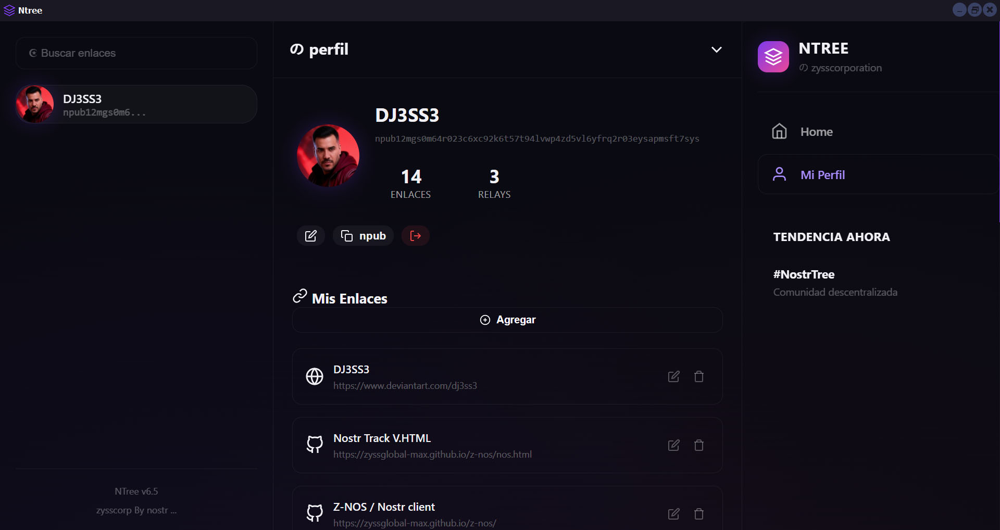

<div align="center">
  <br>
  
  <h1> 🌳 NTree / Nostr client</h1>
  <p><strong>Cliente Nostr de código abierto para el [protocolo Nostr](https://github.com/nostr-protocol/nostr). NostrTree es un cliente enfocado en la persistencia y descentralización de los datos.</strong></p>
  
  <p>
    Libre & de código abierto.<br/>
    Creado por <a href="https://github.com/zyssglobal-max/">ZYSS .CORP</a>, con un estilo moderno, diseño responsive con tema oscuro y animaciones.
  </p>
  
</div>

NostrTree es una aplicación descentralizada para gestionar y compartir enlaces personales usando la red **Nostr**. Permite a los usuarios almacenar sus enlaces de manera permanente en la red descentralizada, donde cualquier usuario puede verlos pero solo el propietario puede editarlos.

<p align="center">
  " style="max-width: 100%; height: auto;">
</p>

## 🚀 Funcionalidades Principales

### 1. 🔐 Autenticación con Clave Privada

**Flujo de autenticación:**
- El usuario ingresa su clave privada **nsec1...** (Nostr Secret Key)
- La clave nunca abandona el navegador (procesamiento local)
- Soporte para generación de nuevas claves desde la interfaz

```javascript
// Ejemplo de decodificación de clave
nsec → privHex → pubHex → npub
```

**Características:**
- ✅ Validación de formato de clave
- ✅ Toggle de visibilidad de clave privada
- ✅ Persistencia en localStorage
- ✅ Generación de nuevas claves

---

### 2. 📡 Conexión a Relays Nostr

**Relays configurados por defecto:**
- `wss://relay.damus.io`
- `wss://nos.lol`
- `wss://relay.primal.net`

**Funcionalidad:**
- Conexión simultánea a múltiples relays
- Reintentos automáticos en caso de fallo
- Estado de conexión visual
- Soporte para agregar relays personalizados

---

### 3. 📝 Gestión de Perfil (Kind 30000)

**Evento Nostr Personalizado:**
```json
{
  "kind": 30000,
  "tags": [["d", "nostrtree_profile"]],
  "content": {
    "name": "Usuario",
    "links": [
      { "title": "Mi Web", "url": "https://...", "icon": "web" }
    ],
    "updated_at": "2026-07-03T..."
  }
}
```

**Datos almacenados:**
- Nombre de usuario
- Lista de enlaces (título, URL, ícono)
- Fecha de última actualización

---

### 4. 🔗 Gestión de Enlaces

#### Agregar Enlace
- **Título** del enlace (requerido)
- **URL** (requerido, formato URL válido)
- **Ícono** (selector con 14 opciones)

#### Editar Enlace
- Click en el ícono de edición ✏️
- Modificar cualquier campo
- Guardar automáticamente en Nostr

#### Eliminar Enlace
- Click en el ícono de eliminar 🗑️
- Confirmación antes de eliminar
- Eliminación automática de la red

#### Íconos Disponibles
<table>
  <thead>
    <tr>
      <th>Ícono</th>
      <th>Uso</th>
      <th>Valor</th>
    </tr>
  </thead>
  <tbody>
    <tr>
      <td>Web</td>
      <td>Enlace genérico</td>
      <td><code>web</code></td>
    </tr>
    <tr>
      <td>GitHub</td>
      <td>Repositorios</td>
      <td><code>github</code></td>
    </tr>
    <tr>
      <td>Twitter/X</td>
      <td>Red social</td>
      <td><code>twitter</code></td>
    </tr>
    <tr>
      <td>YouTube</td>
      <td>Videos</td>
      <td><code>youtube</code></td>
    </tr>
    <tr>
      <td>Instagram</td>
      <td>Fotos</td>
      <td><code>instagram</code></td>
    </tr>
    <tr>
      <td>LinkedIn</td>
      <td>Profesional</td>
      <td><code>linkedin</code></td>
    </tr>
    <tr>
      <td>Spotify</td>
      <td>Música</td>
      <td><code>spotify</code></td>
    </tr>
    <tr>
      <td>Email</td>
      <td>Contacto</td>
      <td><code>email</code></td>
    </tr>
    <tr>
      <td>Nostr</td>
      <td>Perfil Nostr</td>
      <td><code>nostr</code></td>
    </tr>
    <tr>
      <td>Telegram</td>
      <td>Mensajería</td>
      <td><code>telegram</code></td>
    </tr>
    <tr>
      <td>Discord</td>
      <td>Comunidad</td>
      <td><code>discord</code></td>
    </tr>
    <tr>
      <td>Gaming</td>
      <td>Juegos</td>
      <td><code>gaming</code></td>
    </tr>
    <tr>
      <td>Blog</td>
      <td>Artículos</td>
      <td><code>blog</code></td>
    </tr>
  </tbody>
</table>

### 5. 📊 Feed de Enlaces

**Vista Principal:**
- Muestra enlaces de **todos los usuarios**
- Ordenados cronológicamente (más recientes primero)
- Scroll infinito (carga por lotes)

**Interacciones:**
- Click en el enlace → Abre en nueva pestaña
- Ver autor del enlace
- Estadísticas sociales (likes, shares)
- Búsqueda de enlaces

---

### 6. 👤 Perfil de Usuario

**Vista Personal:**
- Foto de perfil (avatar con inicial)
- Nombre de usuario
- Clave pública (npub)
- Contador de enlaces
- Contador de relays conectados

**Acciones:**
- ✏️ Editar nombre de usuario
- 📋 Copiar clave pública (npub)
- 🚪 Cerrar sesión

---

### 7. 💾 Persistencia de Datos

**Almacenamiento Local:**
- `nt_npub`: Clave pública
- `nt_nsec`: Clave privada (nunca sube al servidor)
- `nt_name`: Nombre de usuario
- `nt_links`: Enlaces en caché
- `nt_relays`: Lista de relays

**Sincronización Automática:**
- Cada 30 segundos (si hay cambios)
- Después de cada edición de enlaces
- Conexión/Reconexión a relays

---

### 8. 🔄 Scroll Infinito (Paginación)

**Mecanismo:**
- Carga inicial: **50 enlaces**
- Carga incremental al llegar al final
- Usa `IntersectionObserver` para detectar scroll
- Marca `until` en filtros para paginación

```javascript
// Filtro de paginación
{
  kinds: [30000],
  "#d": ["nostrtree_profile"],
  limit: 50,
  until: timestamp_mas_antiguo
}
```


### 9. 📬 Notificaciones

- Badge indicador en el menú
- Toast notifications para feedback
- Estados:
  - ✅ Éxito (verde)
  - ❌ Error (rojo)
  - ⚠️ Advertencia (amarillo)
  - ℹ️ Información (azul)

---

### 10. 🔍 Búsqueda

- Buscador en la barra lateral izquierda
- Filtro de enlaces por texto
- Presionar Enter para buscar

## 🏗️ Arquitectura Técnica

### Dependencias
```html
<!-- Nostr Tools -->
<script src="https://unpkg.com/nostr-tools@1.17.0/lib/nostr.bundle.js"></script>
```

### Estructura de Datos
```javascript
const S = {
  npub: '',        // Clave pública en formato npub
  nsec: '',        // Clave privada en formato nsec
  pubHex: '',      // Clave pública en hexadecimal
  privHex: '',     // Clave privada en hexadecimal
  name: '',        // Nombre de usuario
  links: [],       // Array de objetos {title, url, icon}
  relays: [],      // Lista de URLs de relays
  connected: false,// Estado de conexión
  allProfiles: [], // Perfiles de otros usuarios
  // ... estados de paginación y UI
}
```

### Flujo de Datos

```
Usuario → Login (nsec) → Decodificar → pubHex + npub
           ↓
Conectar Relays → Suscribir (kind 30000)
           ↓
Cargar Perfil → Renderizar Enlaces
           ↓
Editar Enlaces → Guardar → Publicar Evento
           ↓
Broadcast a Relays → Sincronización
```

## 🎨 Interfaz de Usuario

### Layout (3 Columnas)

<table>
  <thead>
    <tr>
      <th>Izquierda</th>
      <th>Centro</th>
      <th>Derecha</th>
    </tr>
  </thead>
  <tbody>
    <tr>
      <td>Buscador</td>
      <td>Feed/Perfil</td>
      <td>Brand/Navegación</td>
    </tr>
    <tr>
      <td>Perfil usuario</td>
      <td>Publicaciones</td>
      <td>Menú principal</td>
    </tr>
    <tr>
      <td>Footer</td>
      <td>—</td>
      <td>Trending</td>
    </tr>
  </tbody>
</table>

### Responsive
- **> 1200px**: 3 columnas completas
- **900px - 1200px**: Columnas reducidas
- **< 900px**: Vista móvil (una columna)

## 🔧 Comandos y Acciones

### Iniciar Sesión
1. Ingresar clave `nsec1...`
2. (Opcional) Generar nueva clave
3. Configurar relay principal
4. Click "Conectar"

### Gestión de Enlaces
```
Agregar:  Click en "Agregar" → Llenar formulario → Guardar
Editar:   Click ✏️ en el enlace → Modificar → Guardar
Eliminar: Click 🗑️ en el enlace → Confirmar
```

### Navegación
```
Inicio:         Ver feed de enlaces
Mi Perfil:      Ver/editar mis enlaces
Notificaciones: Ver actividad
Favoritos:      Enlaces guardados
```

## ⚡ Eventos Nostr

### Publicar Evento
```javascript
const event = {
  kind: 30000,
  pubkey: S.pubHex,
  created_at: Math.floor(Date.now() / 1000),
  tags: [
    ['d', 'nostrtree_profile'],
    ['title', 'NostrTree Profile'],
    ['app', 'nostrtree'],
    ['version', '2.0']
  ],
  content: JSON.stringify({
    name: S.name,
    links: S.links,
    updated_at: new Date().toISOString()
  })
};
```

### Suscribirse al Feed
```javascript
const filter = {
  kinds: [30000],
  "#d": ["nostrtree_profile"],
  limit: 50
};
ws.send(['REQ', subId, filter]);
```

## 🛡️ Seguridad

1. **Clave privada**: Nunca se envía al servidor
2. **Cifrado**: Todo el procesamiento es local
3. **Firma**: Los eventos se firman localmente
4. **Almacenamiento**: Solo en localStorage del navegador
5. **HTTPS**: Recomendado para producción

## 📱 Casos de Uso

### Usuario Individual
- Crear un "árbol" de enlaces personales
- Compartir perfil con otros
- Acceder desde cualquier dispositivo

### Comunidad
- Descubrir enlaces de otros usuarios
- Follow/Unfollow de perfiles
- Feed personalizado

### Desarrolladores
- API basada en eventos Nostr
- Extensible con nuevos kinds
- Integración con otras apps Nostr

---

## 🐛 Limitaciones Conocidas

1. **Sin autenticación de seguimiento**: Los follows no se implementan
2. **Sin multimedia**: Solo enlaces textuales
3. **Dependencia de relays**: La disponibilidad depende de los relays
4. **Límite de eventos**: Los relays pueden limitar la cantidad de eventos

## 🔮 Mejoras Futuras

- [ ] Follow/Unfollow de usuarios
- [ ] Likes y retweets
- [ ] Imágenes y previews de enlaces
- [ ] Modo oscuro/claro
- [ ] Exportar/Importar enlaces
- [ ] Múltiples "árboles" por usuario
- [ ] Etiquetas/categorías en enlaces
- [ ] Estadísticas de clics

## 🛠️ Tecnologías Utilizadas

-   **[Nostr Protocol](https://nostr.com/):** La base descentralizada de la aplicación.
-   **[nostr-tools](https://github.com/nbd-wtf/nostr-tools):** Librería para interactuar con relays Nostr desde JavaScript.
-   **Vanilla JavaScript:** Sin frameworks, código ligero y eficiente.
-   **WebSockets:** Para comunicación en tiempo real con los relays.

---

## 🙏 Agradecimientos
- **Nostr Protocol**: Red descentralizada
- **Nostr Tools**: Biblioteca de utilidades
- **Comunidad Nostr**: Inspiración y soporte

**🌳 NostrTree - Conectando personas a través de enlaces descentralizados**
---

Repositorio creado con Z-GiUu · 
📅 02/07/2026, 22:53:18
