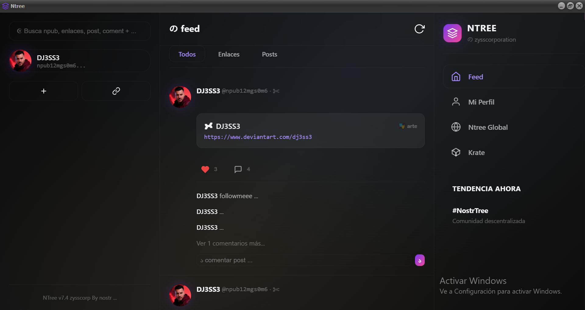

<div align="center">
  <br>
  
  <h1> 🌳 NTree / Nostr client</h1>
  <p><strong>Cliente Nostr de código abierto para el [protocolo Nostr](https://github.com/nostr-protocol/nostr). NostrTree es un cliente enfocado en la persistencia y descentralización de los datos.</strong></p>
  
  <p>
    Libre & de código abierto.<br/>
    Creado por <a href="https://github.com/zyssglobal-max/">ZYSS .CORP</a>, con un estilo moderno, diseño responsive con tema oscuro y animaciones.
  </p>
  
</div>

NostrTree / #NTree es una aplicación #descentralizada para gestionar, #compartir #enlaces personales, mini notas, imágenes seguirle el rastro a sus figuras favoritas usando la #red #Nostr. El fuerte de la app, almacenar sus enlaces de manera permanente en la red descentralizada, donde cualquiera puede verlos e interactuar.

## 🧮 Vista previa



## 🚀 Funcionalidades Principales

### 1. 🔐 Autenticación con Clave Privada

**Flujo de autenticación:**
- El usuario ingresa su clave privada **nsec1...** (Nostr Secret Key) / recomiendo que copies la clave [ nsec ] antes de iniciar sesión ...
- La clave nunca abandona el navegador (procesamiento local)
- Soporte para generación de nuevas claves desde la interfaz

```javascript
// Ejemplo de decodificación de clave
nsec → privHex → pubHex → npub
```

**Características:**
- ✅ Validación de formato de clave
- ✅ Toggle de visibilidad de clave privada
- ✅ Persistencia en localStorage
- ✅ Generación de nuevas claves

### 2. 📡 Conexión a Relays Nostr

**Relays configurados por defecto:**
- `wss://relay.damus.io`
- `wss://nos.lol`
- `wss://relay.primal.net`

**Funcionalidad:**
- Conexión simultánea a múltiples relays
- Reintentos automáticos en caso de fallo
- Estado de conexión visual
- Soporte para agregar relays personalizados

### 3. 📝 Gestión de Perfil (Kind 30000)

**Evento Nostr Personalizado:**
```json
{
  "kind": 30000,
  "tags": [["d", "notree_profile"]],
  "content": {
    "name": "Usuario",
    "links": [
      { "title": "Mi Web", "url": "https://...", "icon": "web" }
    ],
    "updated_at": "2026-07-03T..."
  }
}
```

**Datos almacenados:**
- Nombre de usuario
- Lista de enlaces (título, URL, ícono)
- Fecha de última actualización

### 4. 🔗 Gestión de Enlaces

#### Agregar Enlace
- **Título** del enlace (requerido)
- **URL** (requerido, formato URL válido)
- **Ícono** (selector con 14 opciones)

#### Editar Enlace
- Click en el ícono de edición ✏️
- Modificar cualquier campo
- Guardar automáticamente en Nostr

#### Eliminar Enlace
- Click en el ícono de eliminar 🗑️
- Confirmación antes de eliminar
- Eliminación automática de la red

#### Íconos Disponibles
<table>
  <thead>
    <tr>
      <th>Ícono</th>
      <th>Uso</th>
      <th>Valor</th>
    </tr>
  </thead>
  <tbody>
    <tr>
      <td>Web</td>
      <td>Enlace genérico</td>
      <td><code>web</code></td>
    </tr>
    <tr>
      <td>GitHub</td>
      <td>Repositorios</td>
      <td><code>github</code></td>
    </tr>
    <tr>
      <td>Twitter/X</td>
      <td>Red social</td>
      <td><code>twitter</code></td>
    </tr>
    <tr>
      <td>YouTube</td>
      <td>Videos</td>
      <td><code>youtube</code></td>
    </tr>
    <tr>
      <td>Instagram</td>
      <td>Fotos</td>
      <td><code>instagram</code></td>
    </tr>
    <tr>
      <td>LinkedIn</td>
      <td>Profesional</td>
      <td><code>linkedin</code></td>
    </tr>
    <tr>
      <td>Spotify</td>
      <td>Música</td>
      <td><code>spotify</code></td>
    </tr>
    <tr>
      <td>Email</td>
      <td>Contacto</td>
      <td><code>email</code></td>
    </tr>
    <tr>
      <td>Nostr</td>
      <td>Perfil Nostr</td>
      <td><code>nostr</code></td>
    </tr>
    <tr>
      <td>Telegram</td>
      <td>Mensajería</td>
      <td><code>telegram</code></td>
    </tr>
    <tr>
      <td>Discord</td>
      <td>Comunidad</td>
      <td><code>discord</code></td>
    </tr>
    <tr>
      <td>Gaming</td>
      <td>Juegos</td>
      <td><code>gaming</code></td>
    </tr>
    <tr>
      <td>Blog</td>
      <td>Artículos</td>
      <td><code>blog</code></td>
    </tr>
  </tbody>
</table> & muchos + ...

### 5. 📊 Feed de Enlaces

**Vista Principal:**
- Muestra enlaces de **todos los usuarios**
- Ordenados cronológicamente (más recientes primero)
- Scroll infinito (carga por lotes)

**Interacciones:**
- Click en el enlace → Abre en nueva pestaña
- Ver autor del enlace
- Estadísticas sociales (likes, shares)
- Búsqueda de enlaces

### 6. 👤 Perfil de Usuario

**Vista Personal:**
- Foto de perfil (avatar con inicial)
- Nombre de usuario
- Clave pública (npub)
- Contador de enlaces
- Contador de relays conectados

**Acciones:**
- ✏️ Editar nombre de usuario
- 📋 Copiar clave pública (npub)
- 🚪 Cerrar sesión

### 7. 💾 Persistencia de Datos

**Almacenamiento Local:**
- `nt_npub`: Clave pública
- `nt_nsec`: Clave privada (nunca sube al servidor)
- `nt_name`: Nombre de usuario
- `nt_links`: Enlaces en caché
- `nt_relays`: Lista de relays

**Sincronización Automática:**
- Cada 30 segundos (si hay cambios)
- Después de cada edición de enlaces
- Conexión/Reconexión a relays

### 8. 🔄 Scroll Infinito (Paginación)

**Mecanismo:**
- Carga inicial: **50 enlaces**
- Carga incremental al llegar al final
- Usa `IntersectionObserver` para detectar scroll
- Marca `until` en filtros para paginación

### 9. 🔍 Búsqueda

- Buscador en la barra lateral izquierda
- Filtro de enlaces por texto
- Presionar Enter para buscar

## 🏗️ Arquitectura Técnica

### Dependencias
```html
<!-- Nostr Tools -->
<script src="https://unpkg.com/nostr-tools@1.17.0/lib/nostr.bundle.js"></script>
```

## 🛡️ Seguridad

1. **Clave privada**: Nunca se envía al servidor
2. **Cifrado**: Todo el procesamiento es local
3. **Firma**: Los eventos se firman localmente
4. **Almacenamiento**: Solo en localStorage del navegador
5. **HTTPS**: Recomendado para producción

### Desarrolladores
- API basada en eventos Nostr
- Extensible con nuevos kinds
- Integración con otras apps Nostr

## 🐛 Limitaciones Conocidas

1. **Dependencia de relays**: La disponibilidad depende de los relays
2. **Límite de eventos**: Los relays pueden limitar la cantidad de eventos

## 🔮 Mejoras Futuras

- [ ] Follow/Unfollow de usuarios
- [ ] Retweets
- [ ] Modo oscuro/claro
- [ ] Exportar/Importar enlaces
- [ ] Múltiples "árboles" por usuario
- [ ] Estadísticas de clics

## 🛠️ Tecnologías Utilizadas

-   **[Nostr Protocol](https://nostr.com/):** La base descentralizada de la aplicación.
-   **[nostr-tools](https://github.com/nbd-wtf/nostr-tools):** Librería para interactuar con relays Nostr desde JavaScript.
-   **Vanilla JavaScript:** Sin frameworks, código ligero y eficiente.
-   **WebSockets:** Para comunicación en tiempo real con los relays.

## 🙏 Agradecimientos
- **Nostr Protocol**: Red descentralizada
- **Nostr Tools**: Biblioteca de utilidades
- **Comunidad Nostr**: Inspiración y soporte

**🌳 NostrTree - Conectando personas a través de enlaces descentralizados**
---
Repositorio creado con Z-GiUu · 
📅 02/07/2026, 22:53:18
